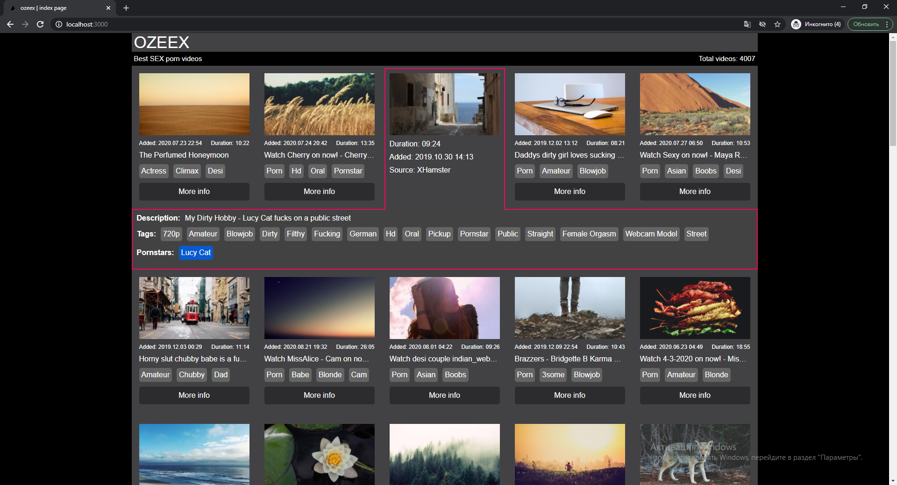
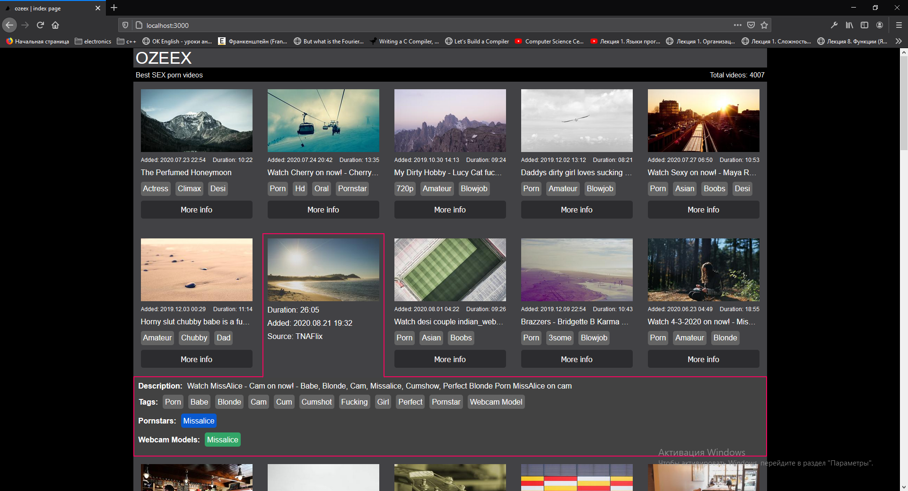
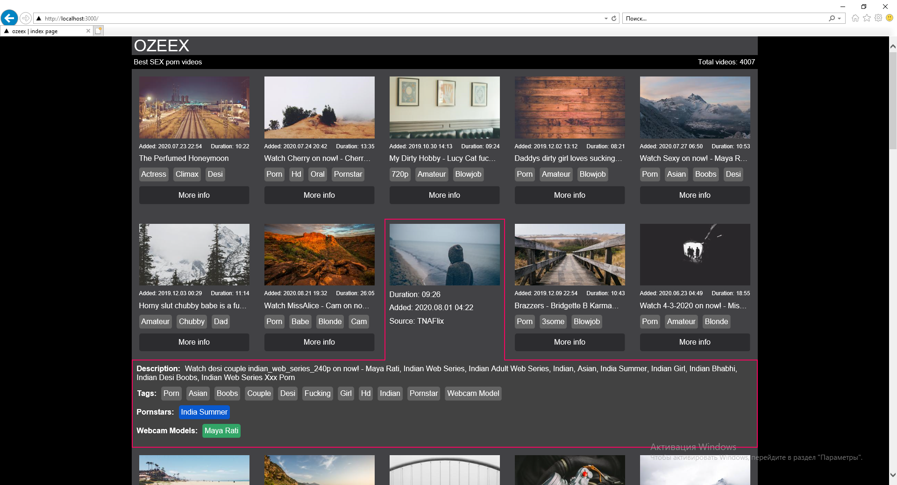
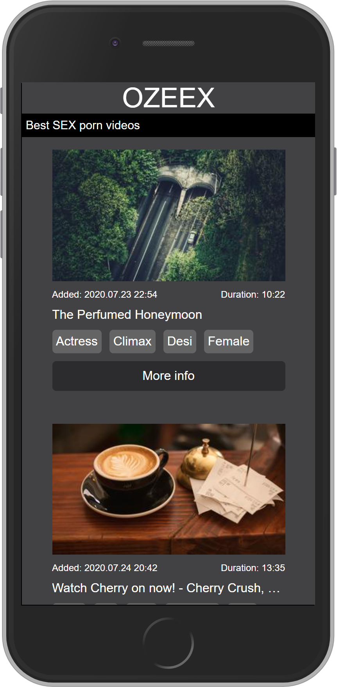
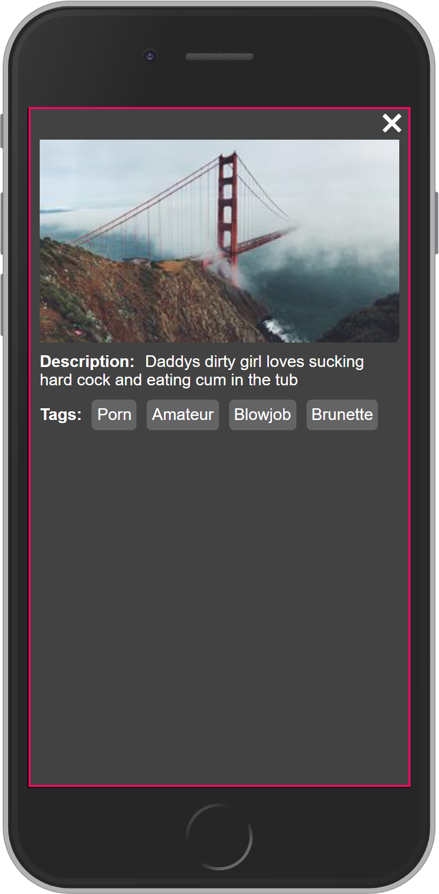
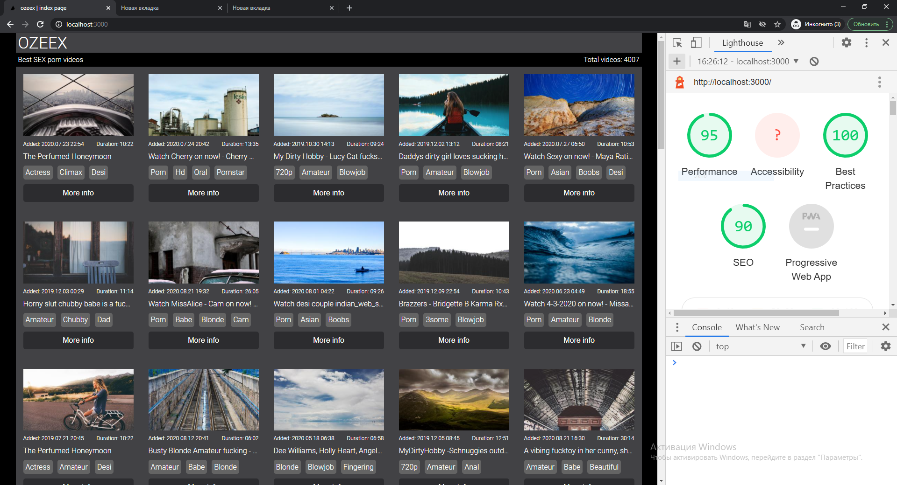
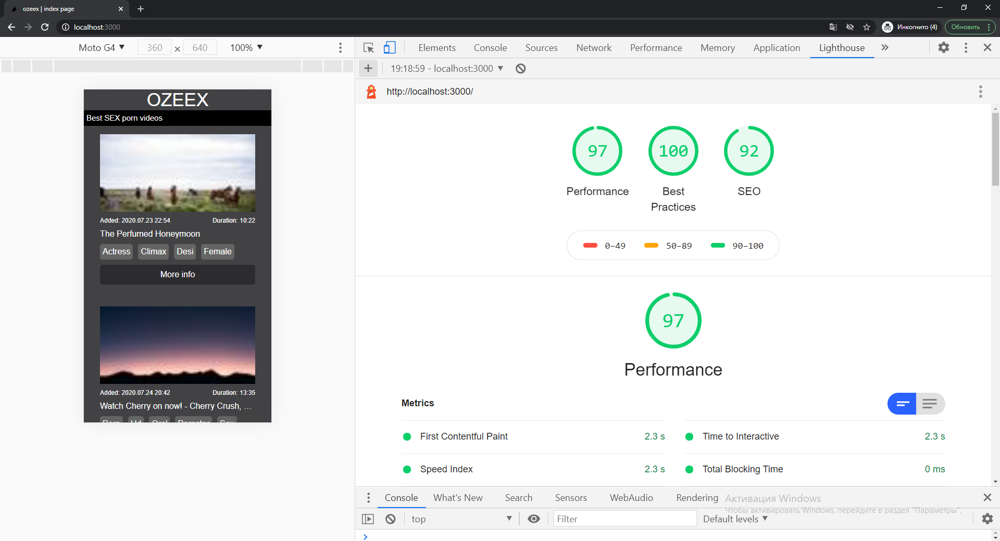

# Решение тестового задания для компании Imhio

## Список технологий:
```
Next, React, TypeScript, Styled Components, Hooks, Context API, HTML5, CSS3, WebPack
```
## Инструкции по развертыванию:
    * выкачать репозиторий: git clone https://github.com/TheVirtualFox/ozeex.git
    * перейти в папку проекта: cd ozeex
    * установить зависимости: npm i
    * установить глобально json-server он будет эмулировать api сервер: npm i -g json-server
    * запустить проект: npm run serve

## Дополнительно:
    в файлах .env и package.json можно выставить порт api по умолчанию 4500

## Информация:

Определение типа устройства desktop или mobile происходит на сервере используя userAgent браузера.
Картинки грузятся лениво, только те, что видит пользователь, пока картинка не загрузилать отображается 
placeholder. В слайдере грузится только первая картинка, остальные грузятся, когда пользователь
включит слайдер. Картинки заменены, что бы можно было сделать скриншоты, на картинки из сервиса https://picsum.photos/320/180
они не кэшируются, так как добавлен query параметр, кол-во картинок для каждого айтема такое же как в оригинальном файле (result.json),
отношение сторон картинок такое же, как в тестовых данных. Можно использовать боевые картинки заменив
```typescript jsx
<LazyImage src={`https://picsum.photos/320/180?cache=${picture.path}`} />
```
на
```typescript jsx
<LazyImage src={picture.path} />
```

Протестировал на Chrome, Firefox, IE





Протестировал на эмуляции мобильного устройства в chrome




## Lighthouse

Параметр Largest Contentful Paint на mobile сильно зависит от размеров картинок,
учитывая то, что сначала пользователю mobile грузится только 2 картинки. Может быть
нужно грузить картинки меньшего качества для mobile клиента.



